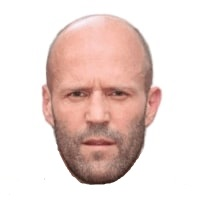
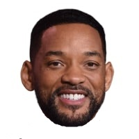
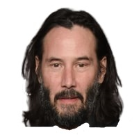
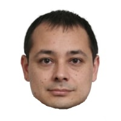
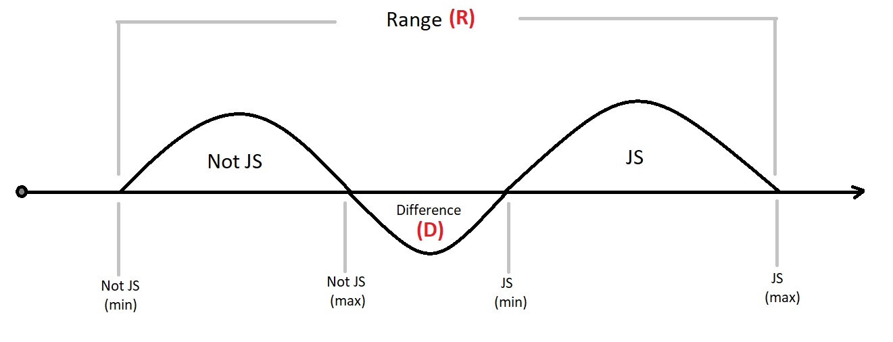

# Face recognition with correlation coefficients and euclidean distance. comparison of the two methods.

## Introduction

The goal of this project is based on photos of a person that we have and know to be his, to establish new test photos whether they are of the same person or not.

Facial recognition has a number of applications
- The realm of security. Identifying a perpetrator of a crime in a photo database.
- Verification in apps with facial recognition
- Unlock phones or laptops with facial recognition

The goal of this project is based on photos of a person that we have and know to be his, to establish new test photos whether they are of the same person or not.

We will compare images by Correlation Coefficients as well as by Euclidean Distance. Presenting their results, we will find out which method gives correct results. We will then compare the performance of the two methods by graphing it and then measuring it.

## Raw Data

For the purposes of the experiment, 10 photos of the actor Jason Statham were collected from the Internet, setting an averaged image.

<tr>
<td>
<td>
<td>
<td>
<td>
</tr>
<tr>
<td>
<td>
<td>
<td>
<td>
</tr>

</table>

Images of other faces are also collected to compare with the averaged one. 4 of them to the same person and 4 to other persons.

<table>
<tr>
<td>
<td>
<td>
<td>
<td>
<td>
<td>
<td>
</tr>
<tr>
<td>test_01_js
<td>test_02_js
<td>test_03_js
<td>test_04_js
<td>test_05_ws
<td>test_06_kr
<td>test_07_jc
<td>test_08_ip
</tr>
<tr>
<td>Jason Statham
<td>Jason Statham
<td>Jason Statham
<td>Jason Statham
<td>Will Smith
<td>Kiano Rives
<td>Jekie Chan
<td>Ivo Petkov (Me)
</tr>
</table>

## Euclidean distance

$$\text{distance} = \sqrt{\sum_{i=1}^{n} (x_i - y_i)^2}\$$

## Correlation coefficients

$$r = \frac{{}\sum_{i=1}^{n} (x_i - \overline{x})(y_i - \overline{y})}
{\sqrt{\sum_{i=1}^{n} (x_i - \overline{x})^2 \sum_{i=1}^{n}(y_i - \overline{y})^2}} $$

## Calculated comparison of the results of the two methods
To compare which of the two methods more clearly distinguishes Jason Statham's images from the others, we will check the boundaries of the two models' values that lie between the two sets of photos.

